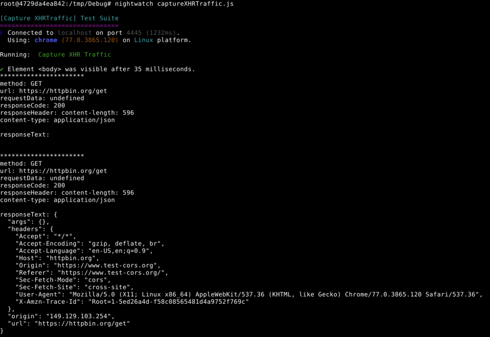

# Nightwatch Capture Network Traffic

Here is the demo for Nightwatch to capture the network traffic.

Give me a :star2:, if it helps. Thank you! :star_struck:



### How to run this demo

```shell script
# Install the chromedriver
# Note: the chromedirver version in package.json is 77.0.0. You may need to change it based on your environment
npm install 

# Run the test
nightwatch captureXHRTraffic.js
```

### How it is working

1. Take advantage of the `ajaxListener.js`

   > The js is forked from https://gist.github.com/icodejs/3183154
   
   This hack will make all the XHR requests as a warn log to console
   
   ```text
    {
        "type": "response",
        "syncMode": this.syncMode,
        "method": this.method,
        "url": this.url,
        "requestData": this.requestData,
        "readyState": this.readyState,
        "responseText": this.responseText,
        "responseCode": this.status,
        "responseHeader": this.getAllResponseHeaders()
    }
    ```
   
2. Then take advantage of Nightwatch API [.getLog](https://nightwatchjs.org/api/getLog.html)

   The [.getLog](https://nightwatchjs.org/api/getLog.html) could capture the console warn logs for us
   
### Limitations

This solution only could capture the **XHR** requests.

If traffic type is **fetch**, it won't working.

For example, all the requests in https://httpbin.org/ are fetch type, this solution is not working.
